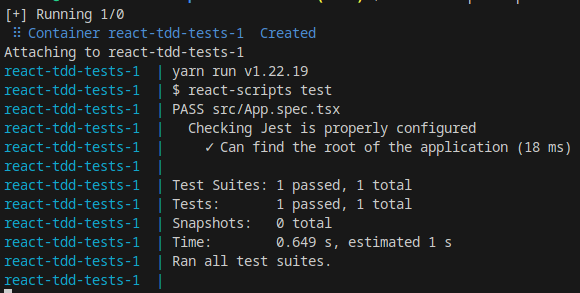
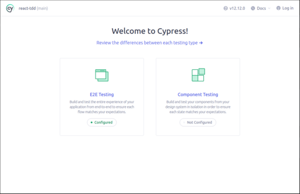
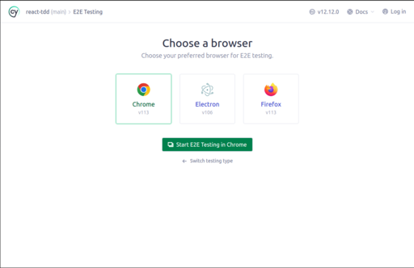
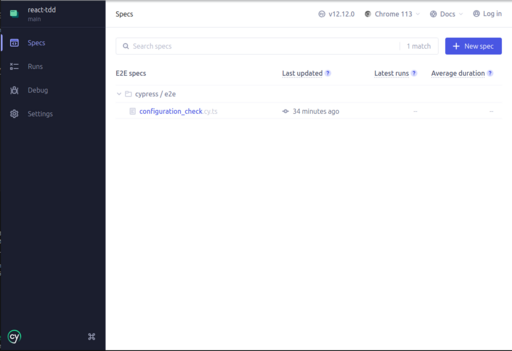
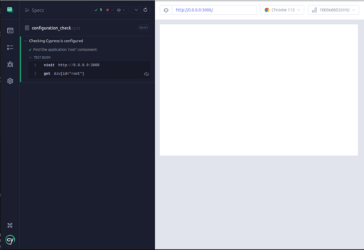
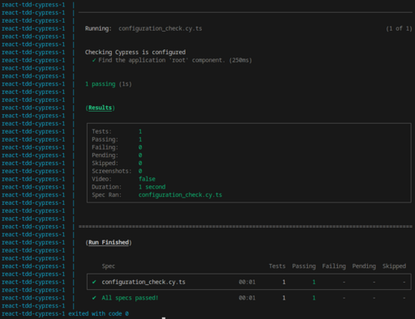

# Getting Started with React and TDD

Test Driven Development (TDD) is a software development approach where tests are written before the implementation of the code. It follows a cycle of "Red-Green-Refactor" to guide the development process.

This template project aims at:
- providing a starting point to create a React application with support for
  - Unit Test, using [Jest](https://jestjs.io/), a delightful JavaScript Testing Framework with a focus on simplicity. This project enables a watch-mode by default, so the added or modified tests are automatically run.
  - E2E Test using [Cypress](https://cypress.io). With Cypress, you can easily create tests for your modern web applications, debug them visually, and automatically run them in your continuous integration builds.
- containerized environment, so all you need is the `docker` and `docker-compose` commands configured on your machine

## Quick start

Clone this repository and jump to [It's playtime](#its-playtime).

## How to start from scratch

Follow the [Start from Scratch](docs/scratch.md) to start from a blank slate.

# It's playtime

Change to the project directory, and run:
```
docker-compose up reactapp
```
to start this shell project. You can open a browser to http://localhost:3000, it supports hot-reload so any change made in the `src` or `public` folder will be updated in the browser automatically.

Open another terminal and run
```
docker-compose up tests
```

This will run the sample test



As you add or modify tests, they will automatically run.


## End-to-end tests

### Natively
Open another terminal and run
```
yarn cypress
```
The first time, you will be presented with this screen:



Click the `E2E Testing` button (it should show as `Configured` in green text below the link). The following will be presented to you:  



Once you have selected a browser, clink on the `Start E2E Testing in <browser name>`

A new window opens:



You can click on the `configuration_check` test and the following result will show:




You are now ready to start your TDD experience!

### Cypress in docker

If you want to run the E2E tests in docker, you will need to change the URL in the [cypress/e2e/configuration_check.cy.ts](cypress/e2e/configuration_check.cy.ts) to use `reactapp` instead of `0.0.0.0`.

You can then run the following command:
```
docker-compose up cypress
```

The output will show as below:



I will add [traefik](https://doc.traefik.io/traefik/providers/docker/) soon in order to be able to run the E2E tests both via docker and natively.


# Credits

This is initially inspired from https://learntdd.in/react/ and enhanced with docker compose, code coverage and code quality via GitHub actions.
